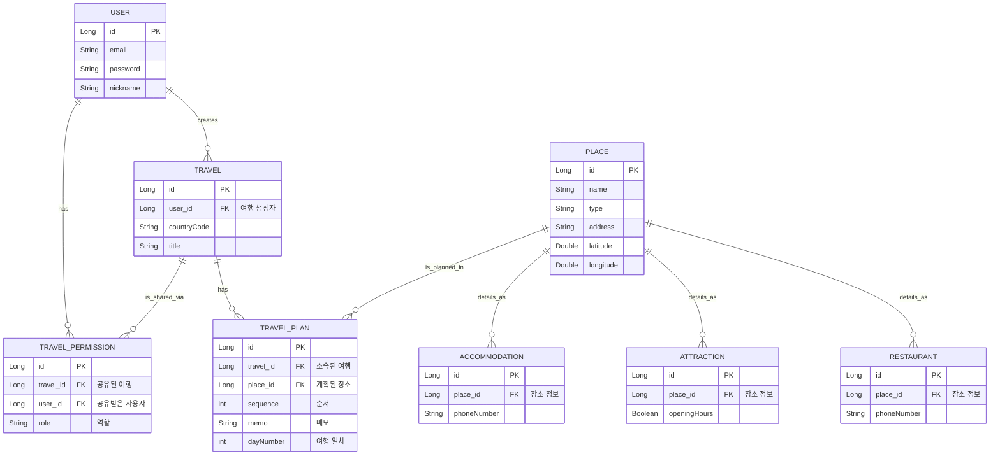

# ERD 구조 개선
프로젝트가 진행됨에 따라 기능이 여러가지가 더 추가되었고 추가된 기능에 따라 데이터베이스가 개선이 되어야한다고 생각해서 ERD 구조를 개선하려고 합니다.

현재 User > Travel > 각종 여행지 
형식으로 이루어져있는데 현재 저희가 추가를 고려하고있는 기능중
> 여행 일정에 따라 여행계획을 세우고 WebSocket을 사용해 계획을 공유할사람과 실시간으로 수정 (및 채팅)이 가능한 기능

> 위 기능을 토대로 세운 계획들을 지도에 1일차 2일차 3일차 이런식으로 구분해서 1 2 3 4 5 로 핀을찍어서 간편하게 보게 해주는 기능

정도가 있을텐데 이 기능을 구현하기 위해서는 Travel 테이블에 여행계획을 일차별로 알 수 있게 혹은 여행계획을 저장하는 테이블을 따로 만들어야 한다고 생각했습니다.

권한별로 계획수정을 나눈다면 User 테이블에 ROLE도 추가 되어야하겠죠
(굳이 권한을 추가하지않고 Travel에 계획을 볼수있는 유저를 저장하는 필드를 만들어 유저를 추가한다거나 여러 방법이 있을거같습니다.)

# 문제 정리
## 1. Travel 테이블에 여행 계획 순서등을 저장할 수 있는 필드 OR 테이블 추가
이 단계에서 생각해 볼 수 있는 방법은 두가지 입니다.
1. 테이블을 여러개 추가해 일차별로 계획 디테일을 저장하는 방법
2. 배열안에 정보를 담아 하나의 컬럼에 넣는 방법

1번의 장점으로는 **쿼리 및 검색에서 매우 효과적이며 데이터무결성, 성능, 확장성을 챙길 수 있습니다.**\
단점으로는 **초기설계가 복잡하며, 데이터를 가져올 때 JOIN 쿼리가 필요합니다.**

2번의 장점으로는 **설계가 단순하며 유연합니다.**\
단점으로는 **검색이 어려움, 업데이트의 비효율성, 데이터 무결성 관리의 어려움**이 있습니다.

## 2. 여행계획수정을 할 수 있는 User 권한 추가 / 혹은 볼 수 있는 User를 Travel에 추가

## 3. 채팅 기능을 추가한다면 테이블을 더 추가해야함 (알림 기능이 있따면 해당 테이블도 추가 필요)

> 2번 3번을 함께 고려해봤을때 1번에서 테이블을 세부적으로 나눠야지 2,3번이 좀 더 편리할거 같네요\
다음 회의때 여행계획순서 테이블 세분화 하면서 같이 고려하면 좋을거같스빈다.

