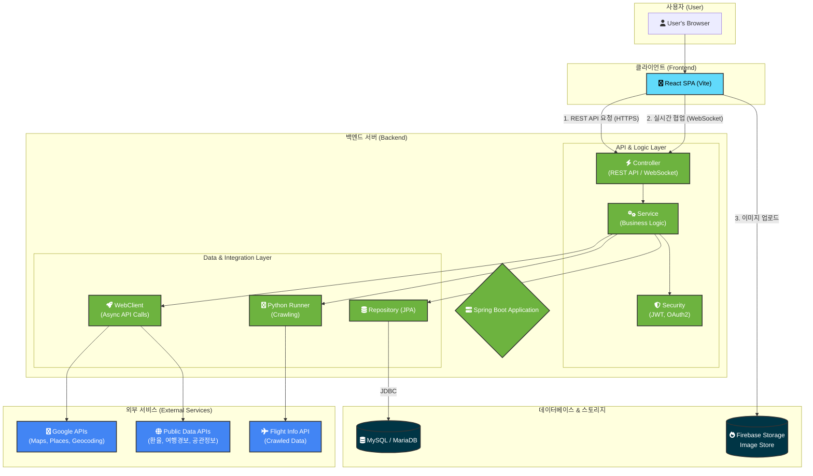

```mermaid
graph TD
    subgraph "사용자 (User)"
        A["fa:fa-user User's Browser"]
    end

    subgraph "클라이언트 (Frontend)"
        B["fa:fa-react React SPA (Vite)"]
    end

    subgraph "백엔드 서버 (Backend)"
        C{"fa:fa-server Spring Boot Application"}
        
        subgraph "API & Logic Layer"
            D["fa:fa-bolt Controller<br/>(REST API / WebSocket)"]
            E["fa:fa-cogs Service<br/>(Business Logic)"]
            F["fa:fa-shield-alt Security<br/>(JWT, OAuth2)"]
        end
        
        subgraph "Data & Integration Layer"
            G["fa:fa-database Repository (JPA)"]
            H["fa:fa-rocket WebClient<br/>(Async API Calls)"]
            I["fa:fa-python Python Runner<br/>(Crawling)"]
        end
    end

    subgraph "데이터베이스 & 스토리지"
        J[("fa:fa-database MySQL / MariaDB")]
        K[("fa:fa-fire Firebase Storage<br/>Image Store")]
    end

    subgraph "외부 서비스 (External Services)"
        L["fa:fa-google Google APIs<br/>(Maps, Places, Geocoding)"]
        M["fa:fa-globe Public Data APIs<br/>(환율, 여행경보, 공관정보)"]
        N["fa:fa-plane Flight Info API<br/>(Crawled Data)"]
    end

    %% --- 연결 관계 정의 ---
    A --> B;

    B -- "1. REST API 요청 (HTTPS)" --> D;
    B -- "2. 실시간 협업 (WebSocket)" --> D;
    B -- "3. 이미지 업로드" --> K;

    D --> E;
    E --> F;
    E --> G;
    E --> H;
    E --> I;

    G -- "JDBC" --> J;
    H --> L;
    H --> M;
    I --> N;

    %% --- 스타일링 ---
    classDef frontend fill:#61DAFB,stroke:#333,stroke-width:2px,color:#000;
    classDef backend fill:#6DB33F,stroke:#333,stroke-width:2px,color:#fff;
    classDef database fill:#003545,stroke:#333,stroke-width:2px,color:#fff;
    classDef external fill:#4285F4,stroke:#333,stroke-width:2px,color:#fff;
    
    class B frontend;
    class C,D,E,F,G,H,I backend;
    class J,K database;
    class L,M,N external;

```