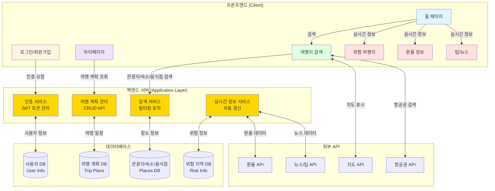
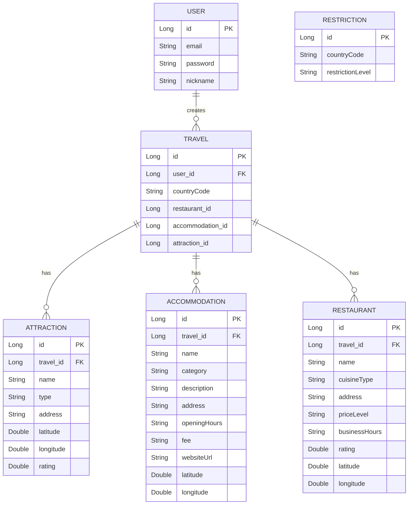

20251029

목표 - AI 활용하기
  
박현우 - 쇼핑몰에 AI 해서 옷추천 등등
  다른 쇼핑몰들을 크롤링해서 우리가 목록으로 보여주는느낌
  단어 입력후 ai가 옷 추천해서 그옷이 있는 쇼핑몰을 목록으로 보여줌
  병원 예약프로그램

박선영 - 지도API로 위치정보

김민수 - 여행지, 옷과 관련된 커뮤니티

  여행지 순위 추천 치안 등등
  여행 금지나라들 안전하게 가지못하게
    나라별 많이 찾는 여행지 순위 
    연계해서 바로 숙박 음식점 등등 예약가능하게
    비행기표까지도
    여행지에서 팁이나 주의사항
    실시간환율 >> 근처에 환전 가능한곳 
    간단한 그나라 회화 ??
    ai로 번역 << ???
    해외에서 필요한 어플 추천어플
    우리나라 대사관
    각종 대사관
  그나라 뉴스 헤드라인들 ai로 요약등 해서 보여주게
  PDF

## 팀명 회의

- 팀장은 Chat GPT

## 주제: 안전하고 편리한 해외여행 가이드 및 계획 서비스

팀의 목표는 **데이터(API)** 를 활용하여 사용자에게 **안전하고 편리한 해외여행 계획**을 수립하고, 여행 중 필요한 실시간 정보를 제공하는 것입니다.

---

## 🔎 주제의 핵심 기능 요약

프로젝트는 크게 **여행 계획 수립**과 **실시간 여행 정보 제공**의 두 축으로 이루어져 있습니다.

### 1. ✈️ 여행 계획 (Planning)

* **여행지 검색 및 저장:** 사용자가 원하는 기간을 설정하여 관광지, 숙소, 음식점 목록을 확인하고, **기간별**로 여행 계획에 저장 및 관리할 수 있습니다.
* **Google Place API 연동:** 구글 지도 API를 활용하여 장소 정보(위치, 평점, 주소 등)를 제공합니다.

### 2. 🚨 안전 및 실시간 정보 제공 (Safety & Real-Time Info)

* **위험 지역 정보:** 여행 금지/경고 국가 목록을 애니메이션으로 표시하여 안전 정보를 시각적으로 전달합니다.
* **실시간 환율 및 환전소:** 여행지별 환율 정보를 실시간으로 제공하며, 주변 환전 가능 장소를 지도 API를 통해 안내합니다.
* **위급 상황 대처:** 나라별 응급 연락처(경찰, 소방, 구급차)와 현지 병원 위치 정보를 제공합니다.

### 3. 🖼️ 데이터베이스 (DB) 구성

* 사용자 정보, 여행 계획, 관광지/숙소/음식점 상세 정보 등을 체계적으로 관리하여 데이터 기반의 서비스를 지원합니다.

------
#### 기능 정리
- 지도 - O 구글맵
- 여행지 순위 - data.co.kr ? google map api
- 여행지별 치안 - data.co.kr ?
- 여행 금지,경고 나라 목록 - O
- 고른 여행지별 숙박, 음식점 등등 목록 - place api
- 고른 여행지 비행기 표 목록 표시 - O
- 해당 여행지 여행시 팁이나 주의사항 
- 해당 여행지 실시간환율 - O
- 환전 가능한 곳 - place api
- 해당 여행지 위급상황시 연락가능한 번호, 병원위치 - place api
- 해당 여행지에서 필요한 어플, 추천어플 - ai
- 해당 여행지의 우리나라 대사관 위치, 각종 대사관 위치 - OO
- 해당 여행지의 간단한 회화 - ai

# 2025-10-30 역할 배분
박선영
  - 여행지 순위( 여행지별 방문객순위 등 )
  - 여행지별 치안 ( 범죄율 등 ) - O
박현우 
  - 여행지별 숙박 - place api OO
  - 여행지별 음식점등 - place api OO
  ( 저희가 특정한 여행지 고르면 특정 범위가 아니더라도 그 나라의 유명 관광지 근처 등등 )
김민수
  - 여행지별 여행시 팁이나 주의사항
  - 환전 가능한 은행이나 환전소 - place api OO
김찬우
  - 여행지별 위급상황시 연락가능한 번호, 병원 - place api OO
    - https://emergencynumberapi.com/api/country/{country}
      - ISO 3166-1 알파-2(Alpha-2): KR
      - ISO 3166-1 숫자(Numeric): 410 
      (구급차, 경찰, 소방서 등등)
    - https://emergencynumberapi.com/api/data/all 
    (호출을 여러번 할 필요없이 모든 데이터를 받아올수있어서 받아서 저장해두고 사용하면 될거같음)
    
  - 여행지별 간단한 회화(음식점이나 호텔 등등)

- 여행지별 필요한 어플이나 추천어플 < 얘는 없거나 너무 적으면 보류

api 제공해주는 사이트를 찾기 힘들다면 정보가 나와있는 사이트나 다운로드 할 수 있는 사이트도 괜찮아요

## BACK & FRONT 정리
박현우 - back \
박선영 - back \
김민수 - back \
김찬우 - front / back 

## 데이터베이스 정리
User - id, email, password, nickname\
Travel - id , user_id, attraction_id, accommodation_id, restaurant_id, country_code \
Attraction - id, travel-id, name, type, address, latitude, longitude, rating\
Accommodation - id, travel-id, name, category, description, address, opening_hours, fee,  website_url , latitude, longitude\
Restaurant - id, travel-id, name, cuisine_type, address, price_level, business_hours, rating, latitude, longitude\
Restriction - id, country_code, restriction_level\
Currency - id, country_code, code(화폐코드), code_kr, symbol, // 보류

나라 - 코드, 이름, 번호 410 KR KOR , , KOR(JPA,ENG)\

대사관 - id, 나라id , 대사관 번호 위치 경도위도\ 박현우

위급번호 - id, 나라id, type, 번호\

팁주의사항 - id, 나라id, 팁, 주의사항 ~\ 김민수

항공편 - id, json
## 엔드포인트 api 명세서
`API명세서.md`
## 프론트 ui ux 디자인
`FRONT/teamproject`

----

api 

유저가 여행을 어디를갈지 숙박 관광 음식점들을 미리 알 수 있게 정리하면서 저장하는느낌이라

- 지도 - O 구글맵
- 여행지 순위 - data.co.kr ? google map api
- 여행지별 치안 - data.co.kr ?
- 여행 금지,경고 나라 목록 - O
- 고른 여행지별 숙박, 음식점 등등 목록 - place api
- 고른 여행지 비행기 표 목록 표시 - O
- 해당 여행지 여행시 팁이나 주의사항 
- 해당 여행지 실시간환율 - O
- 환전 가능한 곳 - place api
- 해당 여행지 위급상황시 연락가능한 번호, 병원위치 - place api
- 해당 여행지에서 필요한 어플, 추천어플 - ai
- 해당 여행지의 우리나라 대사관 위치, 각종 대사관 위치 - OO
<!-- - 해당 여행지의 간단한 회화 - ai -->

홈 > 로그인 / 회원가입
마이페이지 >> 저장한 여행 계획\
홈 - 여행지 검색 / 여행지 순위 / 위험한 여행지 / 여행지별 환율 / 여행지별 팁/뉴스\
여행지 검색(기간설정) > 해당 여행지의 관광지 목록 (추가 버튼 누르면 여행목록에 저장 설정한 기간별로) / 고른 관광지 근처 숙소 목록들(똑같이 날자별 하나씩 여행목록에 저장) / 똑같이 음식점들도\
위험한 여행지 > 애니메이션으로 한방향으로 돌면서 정보 보여줌\
여행지별 환율 > 몇초 간격으로 바뀜\
여행지별 팁/뉴스 > 몇초 간격으로 바뀜

로그인 / 회원가입
- 사용자 정보 (ID, PW, Email 등) 입력 폼
- 사용자 인증 및 토큰 관리 (JWT 등)
- 회원가입, 로그인, 로그아웃 처리 로직
- 비밀번호 찾기/재설정 기능 (선택)

마이페이지 >> 저장한 여행 계획
- 사용자가 저장한 여행 계획 리스트 표시
- 여행 계획 CRUD (생성, 읽기, 수정, 삭제)
- 기간별 여행 일정 관리 및 표시 로직
- 여행 계획 데이터베이스 연동

  메인/탐색 - 홈
  - 여행 일정 입력창 / 여행지 순위 목록
  - 위험한 여행지, 환율, 팁/뉴스 링크 표시

메인/탐색 - 여행지 일정 입력 (기간 설정)
- 관광지 목록 표시 (기간 설정 필터 포함)
- 숙소 목록 표시 (선택한 관광지 근처)
- 음식점 목록 표시 (선택한 관광지 근처)
- 지도 연동 (선택)
- 비행기 항공권 목록

메인/탐색 - 저장 기능
- 관광지/숙소/음식점을 기간별로 여행 목록에 저장하는 로직
- 기간 설정 기능 및 데이터 유효성 검증

실시간 정보-위험한 여행지
- 애니메이션 (자동 슬라이드/회전)을 통한 정보 순환 표시
- 위험 국가/지역 데이터 관리
실시간 정보-여행지별 환율
- 몇 초 간격으로 자동 업데이트/갱신되는 환율 정보 표시
- 환율 API 연동 (외부 API 필요)
실시간 정보-여행지별 팁/뉴스
- 몇 초 간격으로 자동 업데이트/갱신되는 뉴스/팁 정보 표시
- 뉴스/팁 데이터 출처 관리 및 순환 로직

ERD 구조

1. USER ↔ TRAVEL (1:N, 일대다)\
◦ 한 명의 User는 여러 개의 Travel을 생성할 수 있습니다.\
◦ Travel 엔티티의 user 필드가 USER 테이블의 id를 외래 키(user_id)로 참조합니다.\
2. TRAVEL ↔ ATTRACTION, ACCOMMODATION, RESTAURANT (1:N, 일대다)\
◦ 하나의 Travel은 여러 개의 Attraction(관광지), Accommodation(숙소), Restaurant(식당)을 포함할 수 있습니다.\
◦ 각 하위 엔티티(Attraction, Accommodation, Restaurant)는 travel 필드를 통해 TRAVEL 테이블의 id를 외래 키(travel_id)로 참조합니다.\
3. RESTRICTION (독립 엔티티)\
◦ Restriction 엔티티는 다른 엔티티와 직접적인 JPA 관계가 설정되어 있지 않습니다.\
◦ countryCode 필드를 통해 특정 국가의 여행 제한 정보를 저장하며, 비즈니스 로직에서 Travel 엔티티의 countryCode와 연결하여 활용될 수 있습니다.

---

깃허브 브랜치와 PR, 강조사항 주의사항은 2025-11-03 월요일날 안내 하고 작업 시작하겠습니다.
깃허브 푸쉬하거나 문제가 생긴다면 그 즉시 팀원과 공유 하도록 할게요

# 2025-11-03 코드 작성 시작
1. 깃허브 안내
2. 기본세팅 통제
3. 기능 분배
4. 주의 사항, 규칙 안내
5. 작성 시작
  - 천천히 하고 시간마다 진행상황 확인, 어려운거나 막히는거 있으면 팀원들에게 조언 받는느낌으로 해볼게요

사용자 인증(Auth) 구현: 회원가입, 로그인, JWT 토큰을 이용한 인증/인가 로직 구현. (홈, 로그인/회원가입 페이지 $\text{UI/UX}$ 포함)\

기준 정보 $\text{API}$ 구현: 여행 금지/경고 나라 목록(Restriction) 데이터 관리 $\text{API}$ 구현 및 $\text{DB}$에 초기 데이터 삽입.\
위급 상황 $\text{API}$ 통합: 외부 $\text{API}$(emergencynumberapi.com)를 활용하여 나라별 응급 연락처, 병원 위치 데이터를 수집/저장하는 백엔드 로직 구현.\
실시간 환율 $\text{API}$ 통합: 외부 환율 $\text{API}$를 연동하여 실시간 환율 정보를 조회하는 백엔드 서비스 구현.\
여행지 순위 및 치안 정보: $\text{KOSIS}$ 또는 기타 데이터 소스를 분석하여 여행지 순위/치안 데이터를 제공하는 $\text{API}$ 구현.\
$\text{Google Place API}$ 연동 모듈: $\text{Google Place API}$ (숙박, 음식점, 환전소, 병원 등)를 호출하여 데이터를 받아오는 백엔드 모듈 구현.\
프론트엔드 지도 구현: Google Map API를 프론트엔드에 통합하고, 백엔드에서 받은 장소 데이터를 지도에 마커로 표시하는 기능 구현.\
환전소/대사관 위치 $\text{API}$: Place API를 활용하여 환전 가능 장소 및 대사관/영사관 위치를 찾는 $\text{API}$ 구현.\
여행 $\text{CRUD}$ $\text{API}$: TRAVEL 엔티티를 중심으로 새 여행 계획 생성, 조회, 수정, 삭제 $\text{API}$ 구현.\
장소 저장 로직: 여행지 검색 결과에서 사용자가 관광지, 숙소, 음식점을 선택하면, 이를 기간별로 $\text{TRAVEL}$ 계획에 연결하여 $\text{DB}$에 저장하는 $\text{API}$ 구현.\
마이페이지 $\text{UI}$: 마이페이지 $\text{UI}$ 및 저장된 여행 계획 리스트 조회 기능 구현.\
$\text{PDF}$ 다운로드 기능 (선택): 저장된 여행 계획 정보를 $\text{PDF}$ 파일로 출력하는 기능 구현.\
$\text{AI}$ 기반 정보 제공: 여행지별 팁/주의사항, 간단한 회화, 추천 어플 등을 $\text{AI}$ 모델(예: $\text{ChatGPT API}$)을 통해 동적으로 생성하고 $\text{API}$로 제공.\
항공권 정보 표시: 항공권 검색 $\text{API}$(Flight API)를 연동하여 결과 목록을 표시하는 $\text{UI}$ 구현 (예약 기능 제외, 단순 정보 제공).\
$\text{UI/UX}$ 검토 및 버그 수정: 전체 서비스의 $\text{UI/UX}$ 일관성을 최종 검토하고, 발견된 버그 수정 및 성능 최적화.