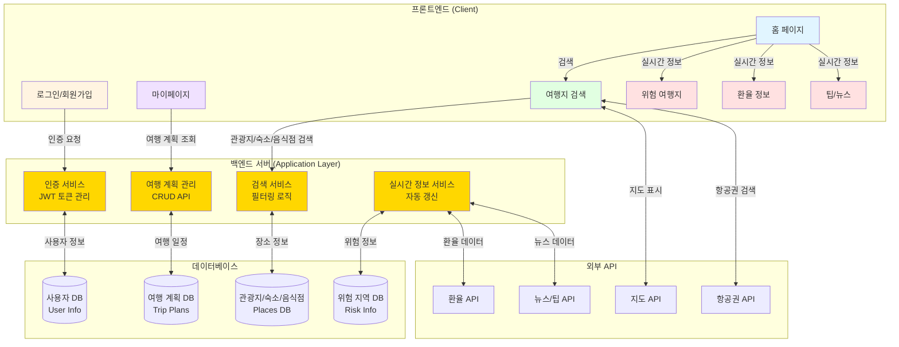
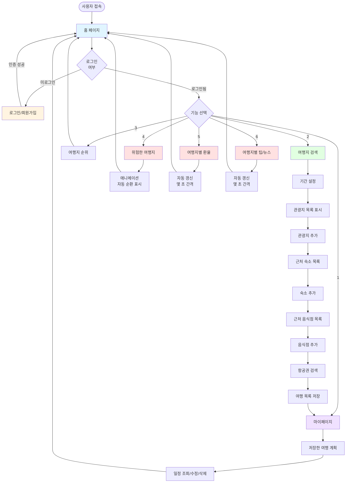
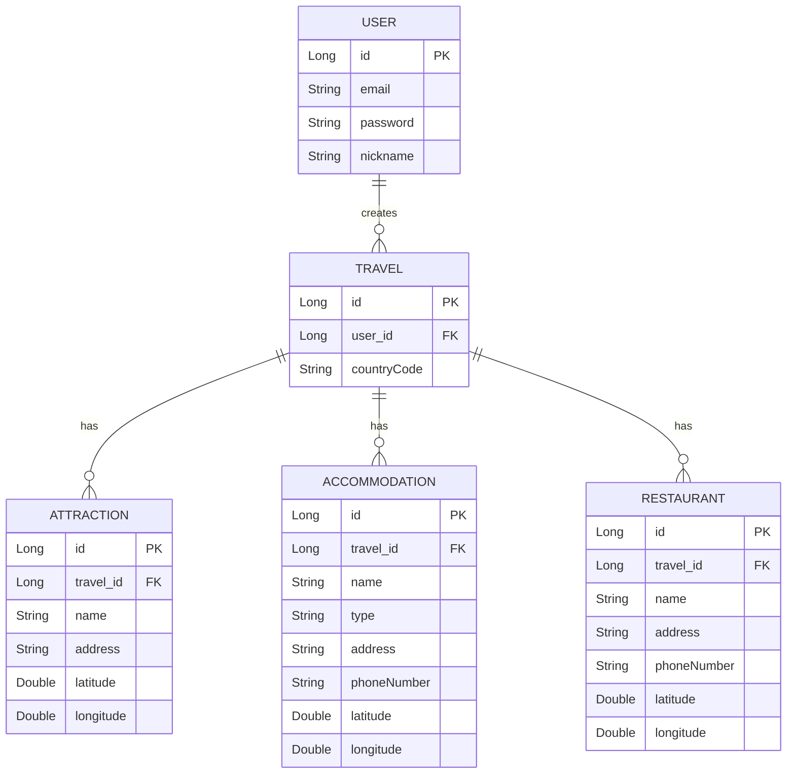

20251029

목표 - AI 활용하기

박현우 - 쇼핑몰에 AI 해서 옷추천 등등
다른 쇼핑몰들을 크롤링해서 우리가 목록으로 보여주는느낌
단어 입력후 ai가 옷 추천해서 그옷이 있는 쇼핑몰을 목록으로 보여줌
병원 예약프로그램

박선영 - 지도API로 위치정보

김민수 - 여행지, 옷과 관련된 커뮤니티

여행지 순위 추천 치안 등등
여행 금지나라들 안전하게 가지못하게
나라별 많이 찾는 여행지 순위
연계해서 바로 숙박 음식점 등등 예약가능하게
비행기표까지도
여행지에서 팁이나 주의사항
실시간환율 >> 근처에 환전 가능한곳
간단한 그나라 회화 ??
ai로 번역 << ???
해외에서 필요한 어플 추천어플
우리나라 대사관
각종 대사관
그나라 뉴스 헤드라인들 ai로 요약등 해서 보여주게
PDF

## 팀명 회의

- 팀장은 Chat GPT

## 주제: 안전하고 편리한 해외여행 가이드 및 계획 서비스

팀의 목표는 **데이터(API)** 를 활용하여 사용자에게 **안전하고 편리한 해외여행 계획**을 수립하고, 여행 중 필요한 실시간 정보를 제공하는 것입니다.

---

## 🔎 주제의 핵심 기능 요약

프로젝트는 크게 **여행 계획 수립**과 **실시간 여행 정보 제공**의 두 축으로 이루어져 있습니다.

### 1. ✈️ 여행 계획 (Planning)

- **여행지 검색 및 저장:** 사용자가 원하는 기간을 설정하여 관광지, 숙소, 음식점 목록을 확인하고, **기간별**로 여행 계획에 저장 및 관리할 수 있습니다.
- **Google Place API 연동:** 구글 지도 API를 활용하여 장소 정보(위치, 평점, 주소 등)를 제공합니다.

### 2. 🚨 안전 및 실시간 정보 제공 (Safety & Real-Time Info)

- **위험 지역 정보:** 여행 금지/경고 국가 목록을 애니메이션으로 표시하여 안전 정보를 시각적으로 전달합니다.
- **실시간 환율 및 환전소:** 여행지별 환율 정보를 실시간으로 제공하며, 주변 환전 가능 장소를 지도 API를 통해 안내합니다.
- **위급 상황 대처:** 나라별 응급 연락처(경찰, 소방, 구급차)와 현지 병원 위치 정보를 제공합니다.

### 3. 🖼️ 데이터베이스 (DB) 구성

- 사용자 정보, 여행 계획, 관광지/숙소/음식점 상세 정보 등을 체계적으로 관리하여 데이터 기반의 서비스를 지원합니다.

---

#### 기능 정리

- 지도 - O 구글맵
- 여행지 순위 - data.co.kr ? google map api
- 여행지별 치안 - data.co.kr ?
- 여행 금지,경고 나라 목록 - O
- 고른 여행지별 숙박, 음식점 등등 목록 - place api
- 고른 여행지 비행기 표 목록 표시 - O
- 해당 여행지 여행시 팁이나 주의사항
- 해당 여행지 실시간환율 - O
- 환전 가능한 곳 - place api
- 해당 여행지 위급상황시 연락가능한 번호, 병원위치 - place api
- 해당 여행지에서 필요한 어플, 추천어플 - ai
- 해당 여행지의 우리나라 대사관 위치, 각종 대사관 위치 - OO
- 해당 여행지의 간단한 회화 - ai

# 2025-10-30 역할 배분

박선영

- 여행지 순위( 여행지별 방문객순위 등 )
- 여행지별 치안 ( 범죄율 등 ) - O
  박현우
- 여행지별 숙박 - place api OO
- 여행지별 음식점등 - place api OO
  ( 저희가 특정한 여행지 고르면 특정 범위가 아니더라도 그 나라의 유명 관광지 근처 등등 )
  김민수
- 여행지별 여행시 팁이나 주의사항
- 환전 가능한 은행이나 환전소 - place api OO
  김찬우
- 여행지별 위급상황시 연락가능한 번호, 병원 - place api OO
  - https://emergencynumberapi.com/api/country/{country}
    - ISO 3166-1 알파-2(Alpha-2): KR
    - ISO 3166-1 숫자(Numeric): 410
      (구급차, 경찰, 소방서 등등)
  - https://emergencynumberapi.com/api/data/all
    (호출을 여러번 할 필요없이 모든 데이터를 받아올수있어서 받아서 저장해두고 사용하면 될거같음)
- 여행지별 간단한 회화(음식점이나 호텔 등등)

- 여행지별 필요한 어플이나 추천어플 < 얘는 없거나 너무 적으면 보류

api 제공해주는 사이트를 찾기 힘들다면 정보가 나와있는 사이트나 다운로드 할 수 있는 사이트도 괜찮아요

## BACK & FRONT 정리

박현우 - back \
박선영 - back \
김민수 - back \
김찬우 - front / back

## 데이터베이스 정리

User - id, email, password, nickname\
Travel - id , user_id, attraction_id, accommodation_id, restaurant_id, country_code \
Attraction - id, travel-id, name, type, address, latitude, longitude, rating\
Accommodation - id, travel-id, name, category, description, address, opening_hours, fee, website_url , latitude, longitude\
Restaurant - id, travel-id, name, cuisine_type, address, price_level, business_hours, rating, latitude, longitude\
Restriction - id, country_code, restriction_level\
Currency - id, country_code, code(화폐코드), code_kr, symbol, // 보류

나라 - 코드, 이름, 번호 410 KR KOR , , KOR(JPA,ENG)\

대사관 - id, 나라id , 대사관 번호 위치 경도위도\ 박현우

위급번호 - id, 나라id, type, 번호\

팁주의사항 - id, 나라id, 팁, 주의사항 ~\ 김민수

항공편 - id, json

## 엔드포인트 api 명세서

`API명세서.md`

## 프론트 ui ux 디자인

`FRONT/teamproject`

---

api

유저가 여행을 어디를갈지 숙박 관광 음식점들을 미리 알 수 있게 정리하면서 저장하는느낌이라

- 지도 - O 구글맵
- 여행지 순위 - data.co.kr ? google map api
- 여행지별 치안 - data.co.kr ?
- 여행 금지,경고 나라 목록 - O
- 고른 여행지별 숙박, 음식점 등등 목록 - place api
- 고른 여행지 비행기 표 목록 표시 - O
- 해당 여행지 여행시 팁이나 주의사항
- 해당 여행지 실시간환율 - O
- 환전 가능한 곳 - place api
- 해당 여행지 위급상황시 연락가능한 번호, 병원위치 - place api
- 해당 여행지에서 필요한 어플, 추천어플 - ai
- 해당 여행지의 우리나라 대사관 위치, 각종 대사관 위치 - OO
<!-- - 해당 여행지의 간단한 회화 - ai -->

홈 > 로그인 / 회원가입
마이페이지 >> 저장한 여행 계획\
홈 - 여행지 검색 / 여행지 순위 / 위험한 여행지 / 여행지별 환율 / 여행지별 팁/뉴스\
여행지 검색(기간설정) > 해당 여행지의 관광지 목록 (추가 버튼 누르면 여행목록에 저장 설정한 기간별로) / 고른 관광지 근처 숙소 목록들(똑같이 날자별 하나씩 여행목록에 저장) / 똑같이 음식점들도\
위험한 여행지 > 애니메이션으로 한방향으로 돌면서 정보 보여줌\
여행지별 환율 > 몇초 간격으로 바뀜\
여행지별 팁/뉴스 > 몇초 간격으로 바뀜

로그인 / 회원가입

- 사용자 정보 (ID, PW, Email 등) 입력 폼
- 사용자 인증 및 토큰 관리 (JWT 등)
- 회원가입, 로그인, 로그아웃 처리 로직
- 비밀번호 찾기/재설정 기능 (선택)

마이페이지 >> 저장한 여행 계획

- 사용자가 저장한 여행 계획 리스트 표시
- 여행 계획 CRUD (생성, 읽기, 수정, 삭제)
- 기간별 여행 일정 관리 및 표시 로직
- 여행 계획 데이터베이스 연동

  메인/탐색 - 홈

  - 여행 일정 입력창 / 여행지 순위 목록
  - 위험한 여행지, 환율, 팁/뉴스 링크 표시

메인/탐색 - 여행지 일정 입력 (기간 설정)

- 관광지 목록 표시 (기간 설정 필터 포함)
- 숙소 목록 표시 (선택한 관광지 근처)
- 음식점 목록 표시 (선택한 관광지 근처)
- 지도 연동 (선택)
- 비행기 항공권 목록

메인/탐색 - 저장 기능

- 관광지/숙소/음식점을 기간별로 여행 목록에 저장하는 로직
- 기간 설정 기능 및 데이터 유효성 검증

실시간 정보-위험한 여행지

- 애니메이션 (자동 슬라이드/회전)을 통한 정보 순환 표시
- 위험 국가/지역 데이터 관리
  실시간 정보-여행지별 환율
- 몇 초 간격으로 자동 업데이트/갱신되는 환율 정보 표시
- 환율 API 연동 (외부 API 필요)
  실시간 정보-여행지별 팁/뉴스
- 몇 초 간격으로 자동 업데이트/갱신되는 뉴스/팁 정보 표시
- 뉴스/팁 데이터 출처 관리 및 순환 로직





ERD 구조



1. USER ↔ TRAVEL (1:N, 일대다)\
   ◦ 한 명의 User는 여러 개의 Travel을 생성할 수 있습니다.\
   ◦ Travel 엔티티의 user 필드가 USER 테이블의 id를 외래 키(user_id)로 참조합니다.\
2. TRAVEL ↔ ATTRACTION, ACCOMMODATION, RESTAURANT (1:N, 일대다)\
   ◦ 하나의 Travel은 여러 개의 Attraction(관광지), Accommodation(숙소), Restaurant(식당)을 포함할 수 있습니다.\
   ◦ 각 하위 엔티티(Attraction, Accommodation, Restaurant)는 travel 필드를 통해 TRAVEL 테이블의 id를 외래 키(travel_id)로 참조합니다.\
3. RESTRICTION (독립 엔티티)\
   ◦ Restriction 엔티티는 다른 엔티티와 직접적인 JPA 관계가 설정되어 있지 않습니다.\
   ◦ countryCode 필드를 통해 특정 국가의 여행 제한 정보를 저장하며, 비즈니스 로직에서 Travel 엔티티의 countryCode와 연결하여 활용될 수 있습니다.

---

깃허브 브랜치와 PR, 강조사항 주의사항은 2025-11-03 월요일날 안내 하고 작업 시작하겠습니다.
깃허브 푸쉬하거나 문제가 생긴다면 그 즉시 팀원과 공유 하도록 할게요

# 2025-11-03 코드 작성 시작

1. 깃허브 안내
2. 기본세팅 통제
3. 기능 분배
4. 주의 사항, 규칙 안내
5. 작성 시작

- 천천히 하고 시간마다 진행상황 확인, 어려운거나 막히는거 있으면 팀원들에게 조언 받는느낌으로 해볼게요

사용자 인증(Auth) 구현: 회원가입, 로그인, JWT 토큰을 이용한 인증/인가 로직 구현. (홈, 로그인/회원가입 페이지 $\text{UI/UX}$ 포함)\

기준 정보 $\text{API}$ 구현: 여행 금지/경고 나라 목록(Restriction) 데이터 관리 $\text{API}$ 구현 및 $\text{DB}$에 초기 데이터 삽입.\
위급 상황 $\text{API}$ 통합: 외부 $\text{API}$(emergencynumberapi.com)를 활용하여 나라별 응급 연락처, 병원 위치 데이터를 수집/저장하는 백엔드 로직 구현.\
실시간 환율 $\text{API}$ 통합: 외부 환율 $\text{API}$를 연동하여 실시간 환율 정보를 조회하는 백엔드 서비스 구현.\
여행지 순위 및 치안 정보: $\text{KOSIS}$ 또는 기타 데이터 소스를 분석하여 여행지 순위/치안 데이터를 제공하는 $\text{API}$ 구현.\
$\text{Google Place API}$ 연동 모듈: $\text{Google Place API}$ (숙박, 음식점, 환전소, 병원 등)를 호출하여 데이터를 받아오는 백엔드 모듈 구현.\
프론트엔드 지도 구현: Google Map API를 프론트엔드에 통합하고, 백엔드에서 받은 장소 데이터를 지도에 마커로 표시하는 기능 구현.\
환전소/대사관 위치 $\text{API}$: Place API를 활용하여 환전 가능 장소 및 대사관/영사관 위치를 찾는 $\text{API}$ 구현.\
여행 $\text{CRUD}$ $\text{API}$: TRAVEL 엔티티를 중심으로 새 여행 계획 생성, 조회, 수정, 삭제 $\text{API}$ 구현.\
장소 저장 로직: 여행지 검색 결과에서 사용자가 관광지, 숙소, 음식점을 선택하면, 이를 기간별로 $\text{TRAVEL}$ 계획에 연결하여 $\text{DB}$에 저장하는 $\text{API}$ 구현.\
마이페이지 $\text{UI}$: 마이페이지 $\text{UI}$ 및 저장된 여행 계획 리스트 조회 기능 구현.\
$\text{PDF}$ 다운로드 기능 (선택): 저장된 여행 계획 정보를 $\text{PDF}$ 파일로 출력하는 기능 구현.\
$\text{AI}$ 기반 정보 제공: 여행지별 팁/주의사항, 간단한 회화, 추천 어플 등을 $\text{AI}$ 모델(예: $\text{ChatGPT API}$)을 통해 동적으로 생성하고 $\text{API}$로 제공.\
항공권 정보 표시: 항공권 검색 $\text{API}$(Flight API)를 연동하여 결과 목록을 표시하는 $\text{UI}$ 구현 (예약 기능 제외, 단순 정보 제공).\
$\text{UI/UX}$ 검토 및 버그 수정: 전체 서비스의 $\text{UI/UX}$ 일관성을 최종 검토하고, 발견된 버그 수정 및 성능 최적화.

# 2025-11-04

WebClient 설명 직접해보고 적용

발표 자료 준비
Figma에 해둔거 사진 올려둘게요
위에있는 주제 , 등등 그대로 쓰면될듯

발표하시는 두분 완벽 이해시키기
질문했을때 ? 바로 나오게

webclient를 써서 저희가 쓰는 모든 api를 일단 baseurl 추가할수있게 WebClientConfig에 추가하기

팀설명 팀소개
주제소개, 개발환경
기능 소개 ------
크롤링 - 파이썬에 PlayWriter 라는 라이브러리를 써서 Html 구조를 파악후에 거기서 텍스트를 뽑아내는 느낌
erd 구조
방향성이나 목표

# 2025-11-05

반장님 WebClient 익히고 남은 api 해보고

남은거 있으면 그거 하고

Spring Data REST 추가 하려고 했지만 불필요함을 느겨 삭제 후 직접 만들기로 했습니다

그리고 Swagger API를 이용해서 모든 엔드포인트를 받아와서
현재 작성되어있는 API 명세서와 비교 후 필요 없는부분 추가해야할 부분 파악하기

이건 발표 끝나고 혹은 준비 다 되고 시간남으면
++ OAuth2
카카오 구글 네이버
1인 1인증

박현우 - WebClient 살짝보고 발표 준비 여기도 끝나면 하나 맡기기
박선영 - 발표준비 끝나면 하나 맡기기
김찬우 - Oauth2 익히기
김민수 - Oauth2 하나 맡기고

그 이후에는 백 끝나고 프론트
메인화면 지금 거의 다 되어있으니까
따로 만들어야 되는 화면은
계획 세우는 화면

- 숙박지 보여주고 / 정렬 - rating순, (거리순)
- 음식점 보여주고 / ``
- 관광지 보여주고 / ``

정리 페이지
내 여행 페이지 내정보
PDF

# 2025-11-06

RestTemplate / WebClient
왜 ? ???????

1. 프론트 ? 백 ?

- 프론트로 하는게 더 간편하지 않냐 ????
  (프론트로하니 보안상 문제가 안ㅇ좋고 프론트 서버가 무거워집니다.)
- 백상에서 호출하고 프론트로 불러오는게 웹사이트 측면에서 좀 더 부담을 적게 해줍니다.

2. RestTemplate ? WebClient ?

- 저희의 프로젝트 진행상 WebClient를 활용하는게 성능면에서 조금 더 우세하다 생각해서 선택하게 되었습니다.
  (RestTemplate 보다 사용하기에 좀 더 용이해 보여서 선택하게 되었다)
  CORS << api 요청을 보내는 주소와 서버의 주소가 다를경우 자체적으로 CORS로 막혀버리기 때문에 우회를 할 필요가 있습니다.
  Front/ BAck 상에서 둘다 우회를 할 수 있는데 위에서 설명했다시피 백에서 하는게 좀더 보안상 좋아서
  백에서 우회를 하여 요청을 보내게 되었스빈다.

프론트 ? 백 ? - 보안문제와 프론트서버 부담 줄이기위해
RestTemplate ? WebClient ? - WebClient가 성능이 더 뛰어나서
CORS - api 요청을 보내는 주소와 서버의 주소가 다를경우 요청을 거부

- FRONT / BACK >> FRONT PROXY설정으로 우회가능 / BACK WebClient로 우회가능

크롤링 << Python 으로 하고 항공권

외부 api로 이걸 db에저장하는지랑 안하는거랑

어떻게ㅐ 이걸 나눌지 조건

- 안바뀌고 한번만 호출해도 되는애들은 일단 DB에 저장해서 쓰는 형식
  실시간으로 받아와야하는 애들은
  db 저장 안하고 그때그때 호출하거나 매번 업데이트되는 시간에 호출해서 갱신하는느낌

# 피드백 정리

외부 api 가져온다는 설명이 많은데 상용화 되어잇는게 많은데
여행팁 관련된 외부 api가 먼지 ?

파이썬 크롤링을 이용해가지고 합체를 하고있는데
파이썬 크롤링을 할때 어느 패키지
여행계획 유저들이 사용할 수 있떤데 HTML 로 저장하기 이전단계에 보면
숙박업소라든지 날짜라든지 선택하는 부분이 있음
그중에 하나라도 빠트리면 다음단계로 안넘어감 필수선택임

-- 위는 피드백 --

AI를 쓰는것처럼 발전할겁니다
대체되지 않으려고 남아있는거
고민을 해봐야 하는 부분이 있습니다.
본인이 하고싶은 이상이랑 실력을 기반으로 기능들을 짰을겁니다.
하지만 프로젝트는 어떤 문제를 왜 우리가 ?
어떻게 해결하고 할지 이 해결을 해서 어떤 기대효과를 낳을지 상정하고 준비를 해야합니다.
취업시장이 실제로 면접에 가보면 압니다.
기술스택이나 프레임워크 물어가면서 어떻게 해결했는지 물어볼겁니다.
기술적인거말고 사람이니까 왜 했는지 어떻게 해결했는지 물어보는사람이 있다.
왜 우리가 이프로젝트를 선정했고 왜 이 기능을 넣지 라는걸 생각해봐야합니다.
돈을 버는 기업으로 들어가니
이 기능이 어떻게 수익구조로 연결되는지
그거까지 연결시키면 채용면접에서도 충분히 답변할수있는게 많이 생길겁니다.
기능들 다 끌어와도 되는데 이유가 명확해야합니다.
고려해보시고 왜 ? 라는 질문을 항상 품고 개발했으면 좋겠습니다.

특정 api를 사용하게된 이유
Google Map API 를사용하게 된 이유는 해외 지도에 대해 다른 map api보다 뛰어난 성능을 보여주기때문에 선택하게 되었습니다.
추가적으로 해외 정보를 받아오기 쉽지 않은데 Google Map Place Api 는 오픈상태 별점 주소 번호 등등 우리나라 map api로는 받기 힘든 정보를 받아올 수 있는 점에서 선택하게 되었습니다.

Python 크롤링
Playwright 최신 오픈 소스 프레임워크

- 모든 주요 최신 브라우저를 기본적으로 지원하며, 단일 API로 이 모든 브라우저에서 코드를 실행
- Playwright는 브라우저와 직접 통신하고 프로세스 간의 통신 오버헤드가 적기 때문에, 다른 자동화 도구에 비해 더 빠르고 안정적입니다.
- Auto-Wait (자동 대기): 요소가 나타날 때까지, 활성화될 때까지, 또는 애니메이션이 끝날 때까지 자동으로 대기하여 테스트의 안정성을 크게 높입니다. (Selenium의 수동적인 sleep()을 대체)

## 발표하면서 나온 IDea
공유해서 웹소켓 활용해서 실시간으로 같이 수정할수있게
여행 ? 비용이 중요하지 / 다양한 숙소 예약 어플이 있는데
예약 비용 이런거 종합해서 최저가순으로 해서 데이터를 보여준다거나 << 정렬 할 수 있음 단지 가격이 안뜰경우 그경우 고려 필요
국내 해외여행 ?? << 국내도 가능함 지금도 하려면 국내 탭 따로 만들어야함
얼마들지 총 예상비용 표시 ? << 좋은듯 베리굿


# 추후에 추가할 기능
구글 Direction API를 활용해 지도를 띄우고 길 경로도 띄울 수 있습니다.
PDF 에 총 정리할때 띄워주면 되게 좋을거같아요
아니면 여행경로를 지정할대 메인화면에 띄우고 선택한 국가 지도를 띄우고
옆에서 나오는 메뉴창에서 목록을 선택하면 해당위치에 핀 찍히고 길 안ㄴ ㅐ경로 ? 그런게 뜨면 되게
좋을거같습니다.
그리고 1일차 2일차 3일차인경우 알아서 톡톡톡 되게 하는 그런 네 느낌이죠

AI 활용 예시
```javascript
당신은 대한민국 여행 경로 전문가입니다. 사용자로부터 여행 정보를 입력받으면, 다음의 **네 줄 형식**에 맞춰 답변을 생성해야 합니다.

1.  **AI추천** (여행지의 컨셉 및 간단 요약)
2.  **1일차** (일정 요약 및 Direction API에 사용할 경로 목록)
3.  **2일차** (일정 요약 및 Direction API에 사용할 경로 목록)
4.  **3일차** (일정 요약 및 Direction API에 사용할 경로 목록)

**규칙:**
* **답변은 오직 다음 네 줄로만 구성되어야 합니다.** 어떠한 인사말, 설명, 추가적인 텍스트도 포함해서는 안 됩니다.
* 각 일차 경로는 반드시 `| Direction API 입력 (순서): [경로 목록]` 형식을 포함해야 합니다.
* 경로 목록은 지도에 순서대로 찍을 수 있도록 **쉼표(,)** 로 구분된 장소의 **정확한 주소 또는 상호명**을 사용해야 합니다.
* 3일 미만의 여행인 경우, 남은 일차는 `3일차: 해당 없음`으로 표시합니다.
* 4일 이상의 여행인 경우, 3일차까지만 제공하고 초과된 일정은 요약에 포함합니다.

**사용자 입력 형식:**
여행 기간: [YYYY-MM-DD] ~ [YYYY-MM-DD], 여행지: [도시/지역], 숙박지: [숙소 이름/주소], 관광지/활동 목록: [쉼표로 구분된 목록]


**지금부터, 사용자의 입력을 받아 해당 형식으로 경로를 생성하세요.**
2025-11-06 ~ 2025-11-08
부산~도쿄
도쿄호텔,도쿄호텔
신오쿠보,시부야
식당,식당

---답변---
AI추천: 부산 출발 도쿄 도착 여정의 핵심 명소와 쇼핑 지역을 중심으로 구성된 효율적인 2박 3일 시내 탐방 코스입니다.
1일차: 부산에서 도쿄 이동 및 신오쿠보 코리안타운 탐방 | Direction API 입력 (순서): 김해국제공항, 나리타 국제공항, 도쿄호텔, 신오쿠보 코리안타운, 식당, 도쿄호텔
2일차: 도쿄의 심장 시부야 스크램블 및 쇼핑 | Direction API 입력 (순서): 도쿄호텔, 시부야 스크램블 교차로, 시부야 109, 식당, 도쿄호텔
3일차: 해당 없음
```


웹소켓을 사용할 경우 데이터베이스 Travel 테이블이나 레스토랑 관광지 숙박지 등에 순서같은걸 의미하는 커럶이있어야하고 그걸 저장해두어ㅑ지 바뀌는걸 웹소켓사에서 넘겨줄수있는느김

웹소켓을 적용한다하면 여행 계획 순서에 대한 테이블 개선이 필요하고
Direction API를 활용해 지도와 길 표시 ? 가능함 이것도 수정하게 된다면 실시간으로 웹소켓과 연동이가능함

핵심기술은 WebClient WebSocket /

ERD 구조 개선 / WebSocket 적용

PDF 로 지도랑 길 뜨는거 보이고 이쁘게 정리하면 좋을거 같고
npm install @stomp/stompjs sockjs-client

WebSocket도 SecurityConfig 설정 풀어놔야지 401 Unauthorized 안뜸


# 2025-11-10

Contoller Service 
엔티티 구조 개선

# 2025-11-11

FRONT
메인페이지 ( 로그인모달, 회원가입등 )
여행계획 페이지 > PDF 페이지
마이페이지

박선영 - 로그인,회원가입 모달
마이페이지 - 박현우
김민수 - 여행계획 기본 페이지 (여행계획 버튼을 눌렀을때 젤 처음 나오는 화면)
김찬우 - 메인페이지 이벤트 추가

해당 페이지 틀만 잡고 React함수 사용해서 백이랑 연결
하면서 컨트롤러 서비스 필요하면 수정 및 추가 가능

문제생기면 호출

# 2025-11-17
박선영 - Oauth2 카카오 > 
박현우 - 스프링부트 한번하고 , 마이페이지 바꾸기
김민수 - 여행계획페이지
김찬우 - 기능추가할거 채팅이나 ai 쓰는거 학습

2 웹소켓 config, controller
3 프론트 처리

```tsx
    {
      path: "/trip",
      name: "trip",
      component: () => import("@/views/TripView.vue"),
      children: [
        {
          path: "list",
          name: "trip-list",
          component: () => import("@/components/trip/TripList.vue"),
        },
        {
          path: "detail/:idx",
          name: "trip-detail",
          component: () => import("@/components/trip/TripModal.vue"),
        },
        {
          path: "list/:word",
          name: "trip-list-popular",
          component: () => import("@/components/trip/TripList.vue"),
        },
      ],
    },
```
라우터 자식으로 처리 하는건 children 에 넣기

알람
id 제목 내용 userid누가 userid누구에게

contorller 
알람.add(new 알람(userid, userid, ~~~님이 메시지를 보냈습니다.))
websocket 신호 ->
신호를 받고 받았으니 특정 상태함수가 변ㄷ경이 될거야
컴포넌트가 재랜더링이 될테고
그러면서 알람목록을 불러오는 axios.get 호출
다시 불러와지는데 useQuery useMutaion 사용해서
처리할 가능성이 매우 높다

Travel Permission 테이블을 이해하고
메시지를 보냈을때 알람이 갈 수 있게 하려면
TravelPermisssion에 유저를 추가하고 권한추가하는 공유 기능을

알람 테이블 만들기
공유 기능 ( 이메일 입력해서 대상 유저에게 알람을 보낸다 : 이메일이 존재하지 않으면 없다고 Alert를 띄운다 )
공유를 했을때 Travel Permission에 추가되는지 확인하고
WebSocket을 이용해서 해당 Travel id 의 TravelPermission이 있다면 (주인, Viewr) 구독 시켜서 메시지를 주고 받을 수 있게 한다.


SMTP
구글 메일 만들기
의존성 추가후 application.properties 에 추가하기
테이블만들기
controller
service

# 2025-11-18

박현우 - 채팅 기능 구현
박선영 - smtp 이메일 인증 하고 다른거 생각
김민수 - 여행계획 페이지 하던거 이어서
김찬우 - 휴식

공유에 role
db
그리고 
채팅 보여주는거
채팅창 목록이 travel id list?? 